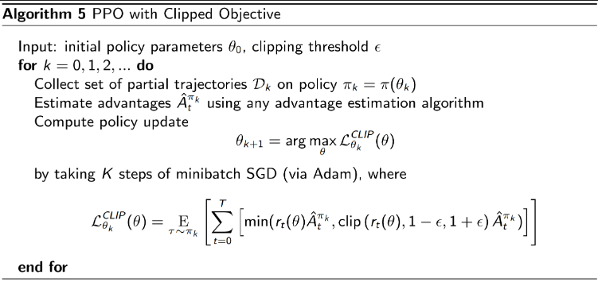
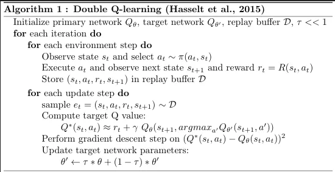
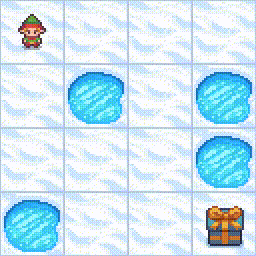

# Reinforecement Learning: OpenAI’s Gym Library

This repository showcases two implementations of reinforcement learning algorithms applied to two environments of the OpenAI’s Gym Library: "*Lunar Lander*" and "*Frozen Lake*"

## LunarLander

Classic rocket trajectory optimization problem. According to Pontryagin’s maximum principle, it is optimal to fire the engine at full throttle or turn it off. This is the reason why this environment has **discrete** actions: engine on or off ([Gymnasium](https://gymnasium.farama.org/environments/box2d/lunar_lander/#lunar-lander)).

### PPO Clip

How can we take the biggest possible improvement step on a policy using the data we currently have, without stepping so far that we accidentally cause performance collapse?

  

### Results

  

## Frozen Lake

Frozen lake involves crossing a frozen lake from start to goal without falling into any holes by walking over the frozen lake. The player may not always move in the intended direction due to the slippery nature of the frozen lake ([Gymnasium](https://gymnasium.farama.org/environments/box2d/lunar_lander/#lunar-lander)).

### Double Deep Q-Learning

Double Deep Q-Learning is used to reduce the maximaztion bias in Q-Learning. This entails using two separate Q-value estimators, each of which is used to update the other. The target values are calculated using a target Q-network. The target Q-network's parameters are updated to the current networks every $C$ time steps.

  

### Results

  

### Credits

* [m4mbo](https://github.com/m4mbo) for the code
* [LMH](https://www.lmh.ox.ac.uk/) summer program on 'AI and ML: Advanced Applications' for the theory